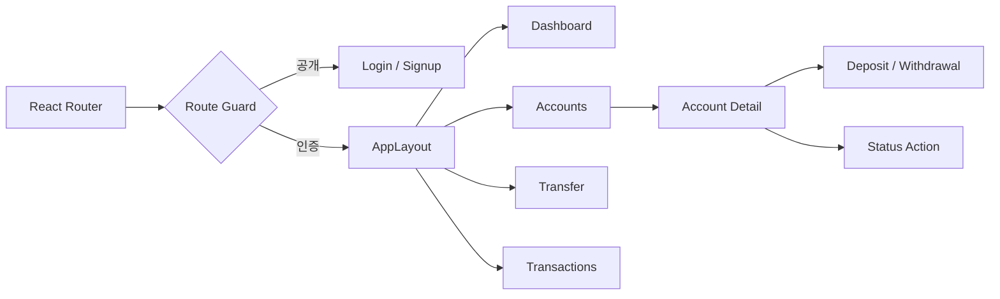
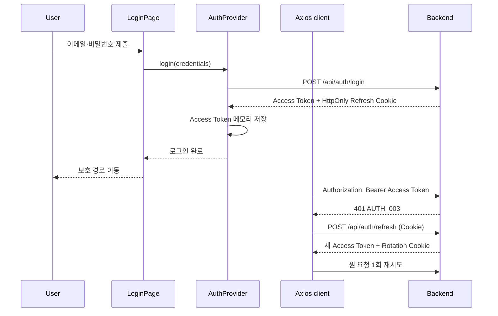
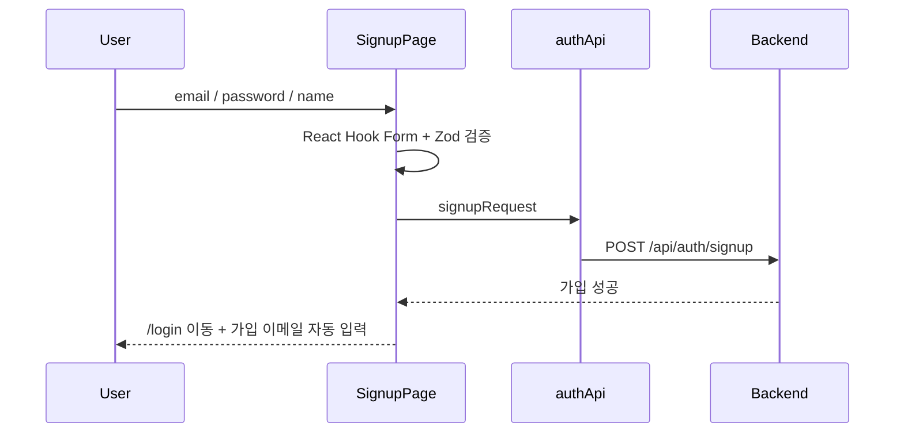
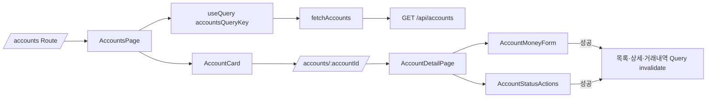
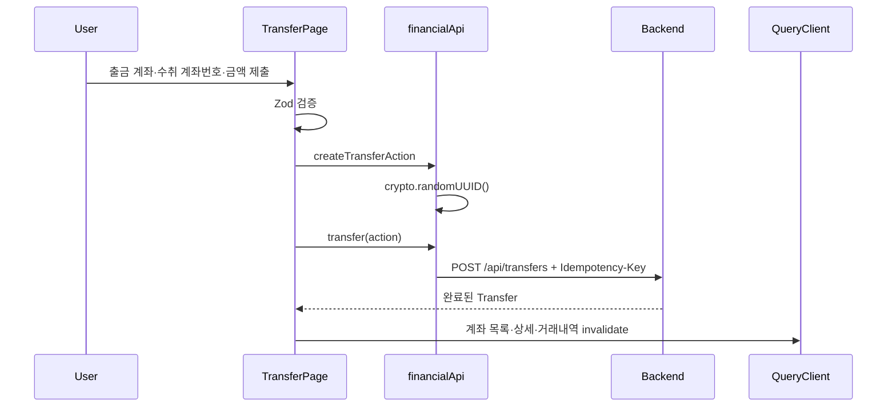

# BankingPJ Frontend

React 19와 TypeScript로 구현한 BankingPJ SPA입니다. 인증 상태를 복원하고, 계좌·금융·거래내역 API의 서버 상태를 화면에 연결하며, 사용자 입력을 Backend 요청 전에 검증합니다.

## 기술과 역할

| 기술 | 역할 |
|---|---|
| React Router | 공개/보호 경로와 페이지 이동 |
| TanStack Query | 계좌·사용자·거래내역 서버 상태 및 캐시 무효화 |
| Axios | 공통 API client, Bearer Header, Refresh 재시도 |
| React Hook Form + Zod | 로그인·회원가입·금융 입력 검증 |
| Vitest + Testing Library | 사용자 관점의 화면·이동·API 연결 검증 |

## 디렉터리 구조

```text
src/
├─ api/             # Backend API 함수, Axios client, Query Key
├─ auth/            # 메모리 Access Token과 Auth Context
├─ components/      # 계좌 카드, 금융 Form, 상태 변경, 공통 UX
├─ layouts/         # 인증 영역 공통 Navigation/Layout
├─ pages/           # Route 단위 화면
├─ routes/          # 공개 전용/인증 필요 Route Guard
├─ test/            # 인증·계좌·금융·Dashboard·거래내역 테스트
├─ types/           # API와 화면 데이터 타입
├─ utils/           # 원화·날짜·계좌 상태 표시
├─ validation/      # 금융 Form Zod Schema
├─ App.tsx          # 전체 Route 선언
└─ main.tsx         # Query/Auth/Router Provider 조립
```

## 라우팅 구조

| 경로 | 접근 | Page | 역할 |
|---|---|---|---|
| `/login` | 비로그인 | `LoginPage` | 로그인과 원래 보호 경로 복귀 |
| `/signup` | 비로그인 | `SignupPage` | 회원가입 후 이메일을 로그인 화면에 전달 |
| `/dashboard` | 인증 | `DashboardPage` | 사용자와 계좌 상태 요약 |
| `/accounts` | 인증 | `AccountsPage` | 계좌 목록과 신규 계좌 생성 |
| `/accounts/:accountId` | 인증 | `AccountDetailPage` | 계좌 상세, 상태 변경, 입출금 |
| `/transfer` | 인증 | `TransferPage` | UUID 멱등성 키 기반 계좌 이체 |
| `/transactions` | 인증 | `TransactionsPage` | 계좌별 Ledger Pagination |

`ProtectedRoute`는 Refresh 기반 인증 초기화가 끝날 때까지 대기한 뒤 비로그인 사용자를 `/login`으로 보냅니다. `PublicOnlyRoute`는 로그인 사용자가 로그인·회원가입 화면에 접근하면 `/dashboard`로 이동시킵니다.

## 전체 사용자 흐름



## 인증과 API 호출

Access Token은 `tokenStore`의 브라우저 메모리에만 저장합니다. Refresh Token은 JavaScript에서 읽지 못하는 Backend의 HttpOnly Cookie로 관리합니다.



동시에 여러 요청이 `AUTH_003`을 받아도 `client.ts`의 공유 `refreshPromise`가 Refresh 요청을 한 번만 실행합니다.

## 주요 기능 흐름

### 회원가입



### 계좌 조회와 변경



### 이체



## Route에서 API까지의 연결

| 사용자 흐름 | Route → Page | API/상태 | 주요 Component |
|---|---|---|---|
| 로그인 | `/login` → `LoginPage` | `AuthProvider.login` → `loginRequest` | `FullPageStatus` |
| 회원가입 | `/signup` → `SignupPage` | `signupRequest` | Form 내부 상태 |
| Dashboard | `/dashboard` → `DashboardPage` | `fetchCurrentUser`, `fetchAccounts` | `AccountCard`, `AsyncState` |
| 계좌 목록 | `/accounts` → `AccountsPage` | `fetchAccounts`, `createAccount` | `AccountCard`, `AsyncState` |
| 계좌 상세 | `/accounts/:id` → `AccountDetailPage` | `fetchAccount` | `AccountMoneyForm`, `AccountStatusActions` |
| 이체 | `/transfer` → `TransferPage` | `createTransferAction`, `transfer` | `AsyncState` |
| 거래내역 | `/transactions` → `TransactionsPage` | `fetchTransactions` | Pagination UI, `AsyncState` |

## 주요 모듈

| 파일 | 역할 |
|---|---|
| `src/App.tsx` | 전체 Route와 Guard 구성 |
| `src/auth/AuthProvider.tsx` | 앱 시작 Refresh, 로그인·로그아웃 상태 제공 |
| `src/auth/tokenStore.ts` | Access Token 메모리 저장과 구독 |
| `src/api/client.ts` | Base URL, 인증 Header, 단일 Refresh 재시도, 오류 추출 |
| `src/api/accountQueryKeys.ts` | 목록·상세·거래내역 캐시 경계 정의 |
| `src/api/financialApi.ts` | 입출금과 UUID 기반 이체 요청 |
| `src/components/AsyncState.tsx` | Loading/Error/Empty 공통 표현 |
| `src/utils/accountFormat.ts` | 문자열 기반 원화 표시와 계좌 상태 Label |

## 실행과 검증

```powershell
Copy-Item .env.example .env.local
npm ci
npm run dev
```

```powershell
npm test
npm run build
npm run lint
```

production build에서는 `VITE_API_BASE_URL`이 필수입니다. `VITE_*` 값은 브라우저에 포함되므로 secret을 넣지 않습니다.
