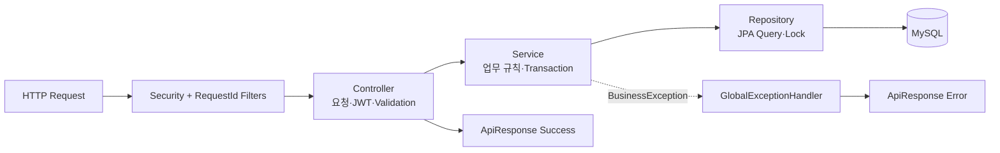
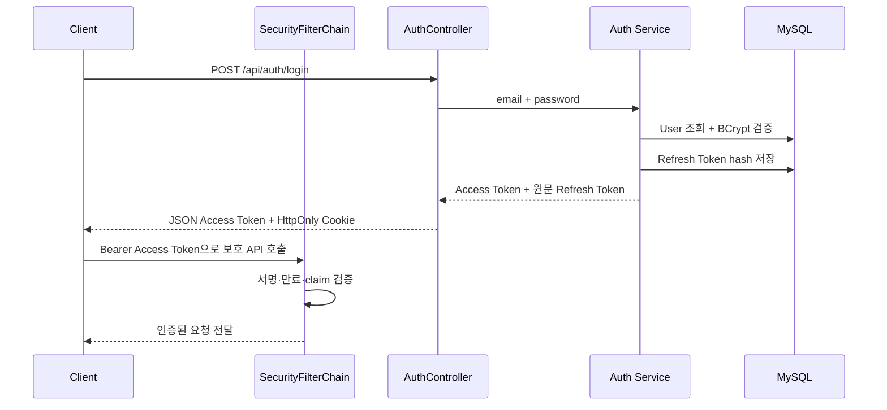
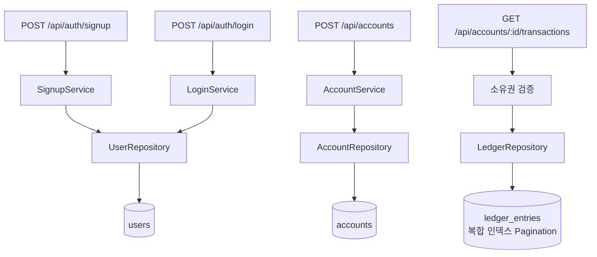
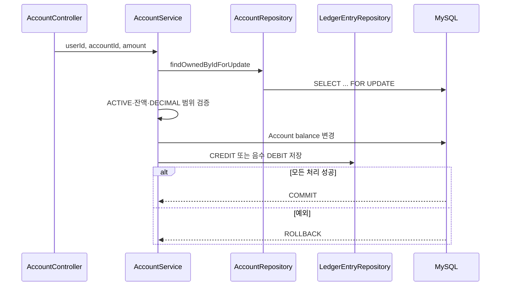
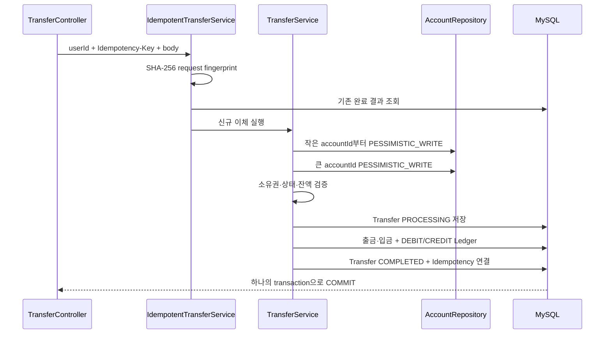
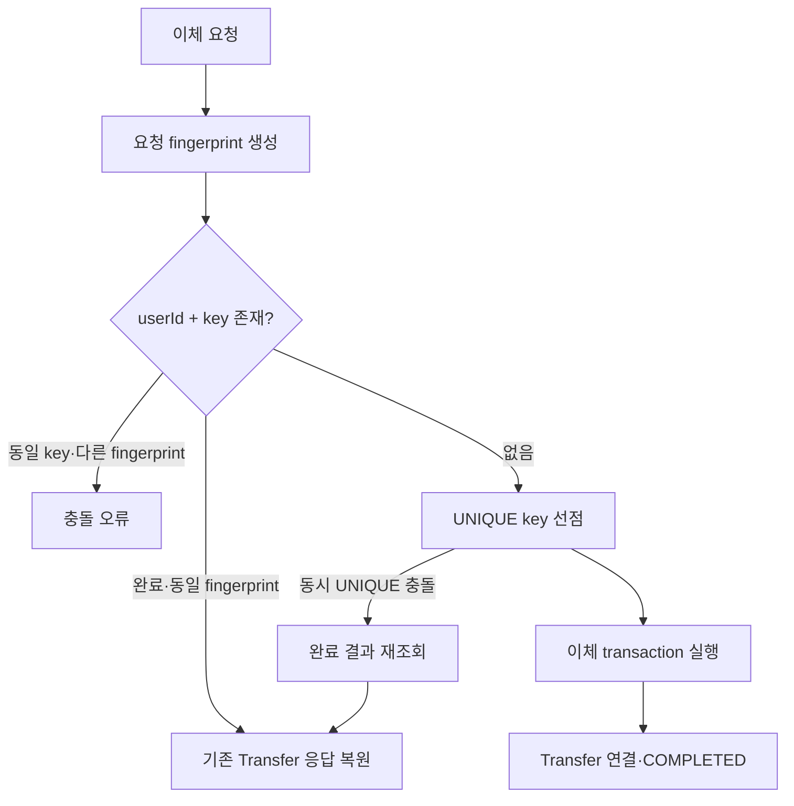
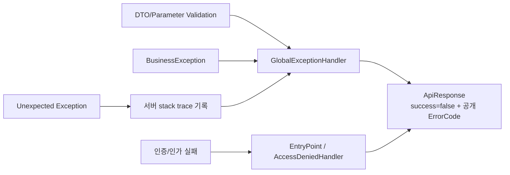

# BankingPJ Backend

Java 21과 Spring Boot 4.1.1 기반 REST API입니다. 인증된 사용자만 자신의 계좌를 조회·변경할 수 있게 하고, 금융 거래의 transaction, lock, idempotency, ledger 정합성을 MySQL에서 보장합니다.

## 패키지 구조

```text
com.bankingpj.backend/
├─ user/                 # 회원가입, 현재 사용자, User 도메인
├─ auth/                 # 로그인, JWT, Refresh Token Rotation
├─ account/              # 계좌 생성·조회·상태·입출금
├─ transfer/             # 이체와 Idempotency
├─ ledger/               # 원장 Entity, 조회 DTO/Repository
├─ performance/          # 명시적 JDBC Batch Seeder와 Reset
└─ common/
   ├─ exception/         # ErrorCode, BusinessException, 공통 Handler
   ├─ logging/           # X-Request-ID Filter와 MDC
   ├─ response/          # ApiResponse, ApiError, PageResponse
   └─ security/          # SecurityFilterChain과 인증 실패 응답
```

각 업무 패키지는 필요한 `controller`, `service`, `repository`, `domain`, `dto`를 내부에 둡니다. 기능을 찾을 때 기술 계층보다 업무 영역을 먼저 따라갈 수 있는 구조입니다.

## 계층 연결



| 계층 | 책임 | 대표 위치 |
|---|---|---|
| Controller | HTTP 계약, DTO Validation, JWT subject 전달 | `AuthController`, `AccountController`, `TransferController` |
| Service | 회원·계좌 상태와 금융 규칙, transaction 경계 | `AccountService`, `TransferService`, `RefreshTokenService` |
| Repository | Entity 조회·저장, 비관적 잠금, Pagination | `AccountRepository`, `LedgerEntryRepository` |
| Domain | 상태 전이와 금액 변경 | `User`, `Account`, `Transfer`, `LedgerEntry` |
| Common | 공통 응답·예외·보안·요청 추적 | `common/*` |

## 인증 구조

`/api/auth/signup`, `/login`, `/refresh`, `/logout`과 health 조회만 공개하며 나머지 API는 JWT 인증이 필요합니다.



- Access Token은 HMAC JWT로 발급하고 Spring OAuth2 Resource Server가 검증합니다.
- Refresh Token 원문은 Cookie로만 전달하고 DB에는 SHA-256 hash만 저장합니다.
- Refresh 시 해당 행을 잠근 뒤 기존 토큰을 폐기하고 새 토큰으로 rotation합니다.
- 로그인 시 존재하지 않는 이메일도 dummy BCrypt 검증을 실행해 응답 시간 차이를 줄입니다.
- CORS는 환경변수에 지정한 명시적 Origin만 허용하며 credential과 `*`을 함께 사용하지 않습니다.

## 주요 업무 흐름

### 회원가입·계좌 생성·거래내역



### 입금과 출금



### 계좌 이체



`TransferService.transfer`가 두 계좌의 stable lock order와 실제 잔액 이동을 담당합니다. `TransferIdempotencyTransactionService.executeNew`는 멱등성 선점, 이체, 완료 결과 연결을 하나의 transaction으로 묶습니다.

### Idempotency Replay



## Lock·Transaction·Idempotency 위치

| 관심사 | 동작 위치 | DB 보장 |
|---|---|---|
| 입출금/상태 Lock | `AccountRepository.findOwnedByIdForUpdate` | `PESSIMISTIC_WRITE` |
| 이체 Lock 순서 | `TransferService.lockAccountsInIdOrder` | account ID 오름차순 잠금 |
| 이체 원자성 | `TransferService.transfer` | 잔액·Transfer·Ledger rollback |
| 멱등성 transaction | `TransferIdempotencyTransactionService.executeNew` | 선점부터 결과 연결까지 원자적 처리 |
| 동시 중복 차단 | Flyway V8 UNIQUE `(user_id, idempotency_key)` | 한 요청만 신규 처리 |
| 거래내역 정렬 | Flyway V9 복합 인덱스 | 계좌·생성시각·원장 ID 정렬 |

## 예외 처리



Validation 실패는 `COMMON_001`, 예상하지 못한 예외는 `COMMON_999`로 반환합니다. 내부 exception message와 stack trace는 응답 body에 넣지 않습니다. `RequestIdFilter`는 요청의 `X-Request-ID`를 재사용하거나 UUID를 만들고 응답 Header와 MDC에 연결한 뒤 `finally`에서 제거합니다.

## 핵심 클래스

| 클래스 | 역할 |
|---|---|
| `SecurityConfig` | 공개/보호 경로, JWT, CORS, 인증 오류 처리 |
| `SignupService` | 이메일 중복과 BCrypt 회원가입 |
| `LoginService` | 자격 증명 검증과 Access/Refresh 발급 |
| `RefreshTokenService` | Refresh 행 잠금, rotation, logout 폐기 |
| `AccountService` | 계좌 소유권·상태·입출금·거래내역 |
| `TransferService` | stable lock order, 잔액 이동, Transfer/Ledger |
| `IdempotentTransferService` | fingerprint와 replay/new 실행 조정 |
| `GlobalExceptionHandler` | 공통 검증·업무·서버 오류 응답 |
| `PerformanceDataSeeder` | 일반 실행과 분리된 JDBC Batch 성능 데이터 생성 |

## DB Migration

Flyway V2~V9가 `users`, `accounts`, `refresh_tokens`, `ledger_entries`, `transfers`, `transfer_idempotencies`와 거래내역 복합 인덱스를 순서대로 구성합니다. 기존 migration은 수정하지 않고 새 변경을 다음 버전 파일로 추가합니다. Hibernate는 `ddl-auto=validate`로 스키마를 검증합니다.

## 실행과 검증

루트 `.env`를 사용하는 권장 실행:

```powershell
cd C:\BankingPJ
.\run-backend.ps1
```

Backend에서 직접 실행:

```powershell
.\gradlew.bat bootRun
.\gradlew.bat test
.\gradlew.bat concurrencyTest
```

`seedData`와 `resetSeedData`는 `bankingpj_perf` 전용 명시적 성능 작업입니다. 일반 실행이나 운영 AWS DB에서는 사용하지 않습니다.
