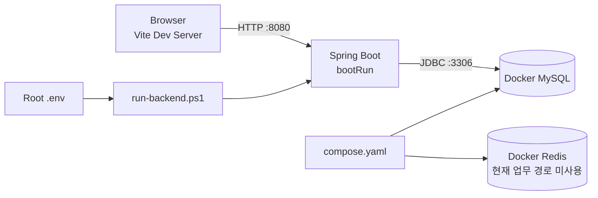
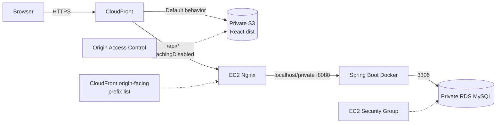
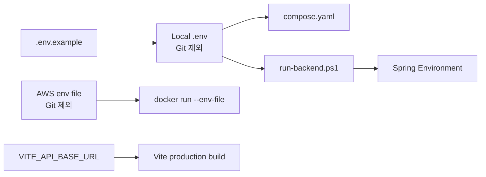
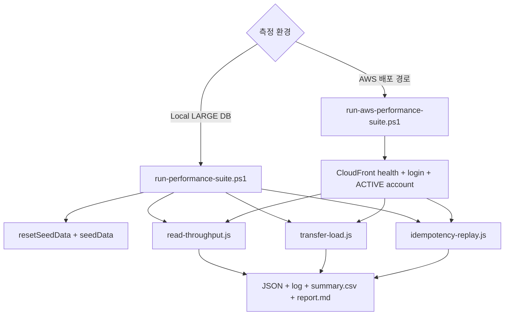

# BankingPJ Infra

로컬 개발용 컨테이너, AWS 배포 지침, Local/AWS k6 성능 테스트를 연결하는 인프라 문서 영역입니다. 실제 secret과 raw 성능 결과는 Git에서 제외합니다.

## 구조

```text
BankingPJ/
├─ compose.yaml                       # Local MySQL/Redis
├─ .env.example                       # 공통 환경변수 이름과 placeholder
├─ 02.backend/Dockerfile              # Java 21 multi-stage Backend image
└─ 03.infra/
   ├─ README.md                       # 이 문서
   ├─ aws/
   │  └─ README.md                    # EC2/RDS/S3/CloudFront 배포 절차
   └─ k6/
      ├─ lib/common.js                # 환경변수·응답·공통 metric 도구
      ├─ account-transactions-baseline.js
      ├─ read-throughput.js
      ├─ transfer-load.js
      ├─ idempotency-replay.js
      ├─ run-performance-suite.ps1    # Local 전체 runner
      ├─ run-aws-performance-suite.ps1# AWS E2E runner
      └─ README.md                    # 상세 실행법
```

## 구성요소 역할

| 구성요소 | 역할 |
|---|---|
| Docker Compose | Local MySQL 8과 Redis 컨테이너, volume, health check |
| MySQL | 회원·계좌·토큰·Transfer·Ledger·Idempotency 영속성 |
| Backend Dockerfile | Gradle bootJar 빌드 후 Java 21 JRE, non-root 사용자로 실행 |
| Nginx | EC2에서 CloudFront의 `/api/*` 요청을 Spring Docker로 전달 |
| CloudFront | Private S3 Frontend와 EC2 API의 단일 HTTPS 진입점 |
| k6 | 읽기 처리량, General/Hot 이체, Idempotency Replay 측정 |

Redis는 Local Compose에 준비되어 있지만 현재 인증·멱등성의 저장소로 사용하지 않습니다. Refresh Token과 Idempotency는 MySQL에서 처리합니다.

## Local 개발 인프라



로컬 구동 순서:

```powershell
cd C:\BankingPJ
Copy-Item .env.example .env
docker compose up -d
.\run-backend.ps1
```

Frontend는 별도 PowerShell에서 실행합니다.

```powershell
cd C:\BankingPJ\01.frontend
Copy-Item .env.example .env.local
npm ci
npm run dev
```

## AWS 배포 구조



### 경계와 보안

- S3는 public website hosting 대신 Private bucket과 CloudFront OAC를 사용했습니다.
- RDS Public Access를 끄고 3306 inbound를 EC2 Security Group으로 제한했습니다.
- Spring 8080은 외부에 공개하지 않고 EC2 Nginx를 통해서만 접근했습니다.
- EC2 HTTP 80은 CloudFront origin-facing prefix list로 제한했습니다.
- CloudFront `/api/*`는 `CachingDisabled`로 설정해 인증·금융 응답을 캐시하지 않았습니다.
- React Router 새로고침은 CloudFront의 403/404를 `/index.html` 200으로 매핑했습니다.
- 테스트 완료 후 비용 방지를 위해 AWS 리소스는 삭제했습니다.

배포 명령과 환경변수 이름은 [`aws/README.md`](aws/README.md)에 있습니다. 문서에는 실제 endpoint, IP, 비밀번호, JWT secret을 기록하지 않습니다.

## 설정 파일 연결



| 파일 | 역할 |
|---|---|
| `compose.yaml` | MySQL/Redis image, port, volume, health check |
| `.env.example` | 로컬·Backend 환경변수 이름과 비밀값 없는 예시 |
| `run-backend.ps1` | 루트 `.env` 파싱, DB 변수명 매핑, `bootRun` 실행 |
| `02.backend/Dockerfile` | Java 21 multi-stage build와 non-root runtime |
| `03.infra/aws/README.md` | RDS 연결, Backend Docker, S3/CloudFront 배포 절차 |
| `01.frontend/.env.example` | Vite API Base URL 예시 |

## k6 스크립트

| 스크립트 | 사용하는 환경 | 역할 |
|---|---|---|
| `account-transactions-baseline.js` | 단일 Local baseline | 로그인 후 거래내역을 단계적 VU로 조회 |
| `read-throughput.js` | Local/AWS suite | `page=0&size=20` 거래내역을 지정 RPS로 반복 조회 |
| `transfer-load.js` | Local/AWS suite | 여러 계좌 General 또는 동일 source Hot Account 이체 |
| `idempotency-replay.js` | Local/AWS suite | 동일 key/body replay의 transferId와 Ledger 중복 방지 검증 |
| `run-performance-suite.ps1` | `bankingpj_perf` Local | reset/seed, warm-up, Local 시나리오, summary/report 조정 |
| `run-aws-performance-suite.ps1` | 배포된 AWS | health/login/account preflight, REST 최소 데이터, AWS E2E 시나리오 |



### Local 성능 suite

반드시 별도 `bankingpj_perf` DB에서 실행합니다. LARGE/MEDIUM/SMALL Seeder는 일반 개발 DB나 운영 DB에서 사용하지 않습니다.

```powershell
cd C:\BankingPJ
.\03.infra\k6\run-performance-suite.ps1 -DatabaseName bankingpj_perf -Scale LARGE
```

### AWS E2E suite

AWS runner는 Seeder와 DB 직접 INSERT를 사용하지 않고 `k6-aws-*` 테스트 사용자와 최소 계좌를 REST API로 준비합니다.

```powershell
cd C:\BankingPJ
.\03.infra\k6\run-aws-performance-suite.ps1
```

AWS 리소스가 삭제된 현재는 기존 실측 결과 문서만 유지합니다. 재배포 없이 runner를 실행할 수 없습니다.

## 결과와 Git 정책

- `03.infra/k6/results/`의 JSON, log, CSV, report는 raw 실행 결과이므로 Git에서 제외합니다.
- 최종 실측값으로 만든 루트 README 표와 `docs/assets/` 그래프는 버전 관리합니다.
- `.env`, `.env.*`, AWS runtime env, build output, cache와 로그는 Git에서 제외합니다.
- k6 source, runner, README, Dockerfile과 `.env.example`은 버전 관리합니다.
