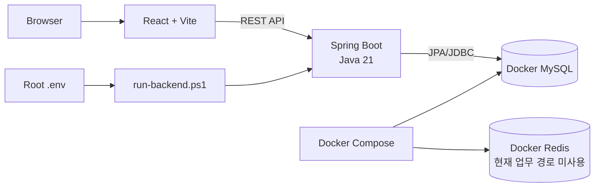
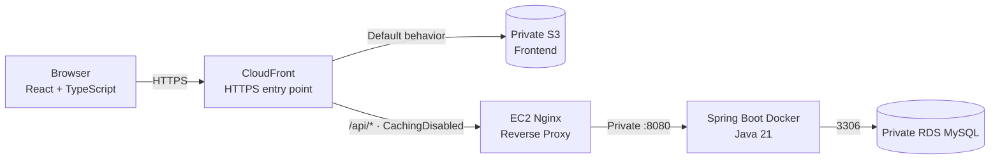
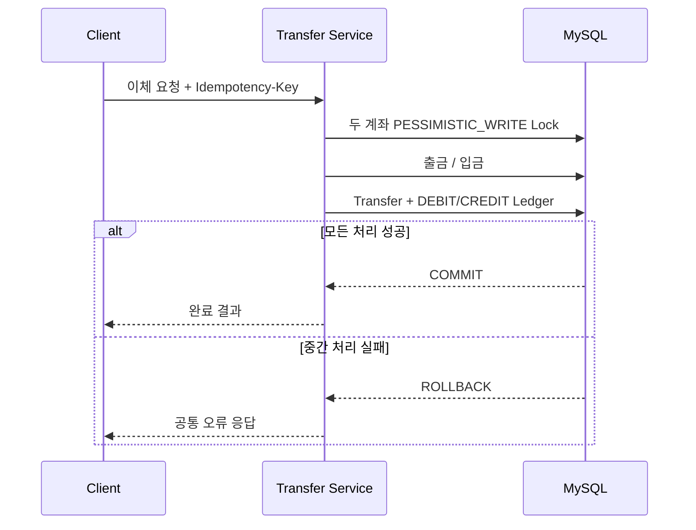
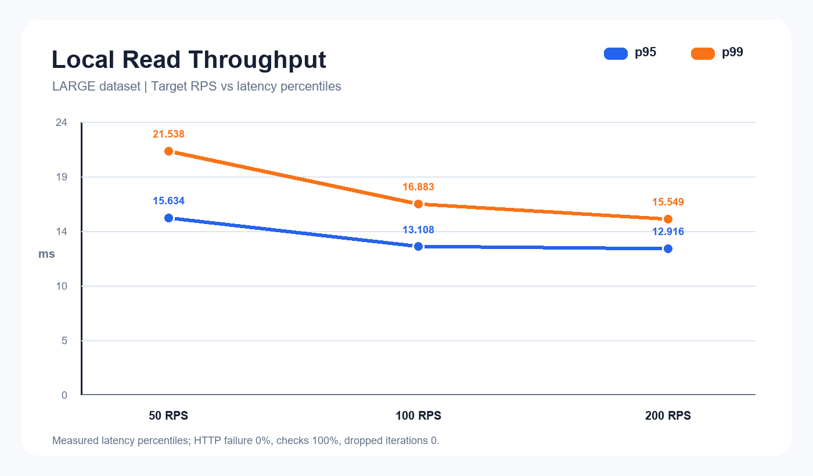
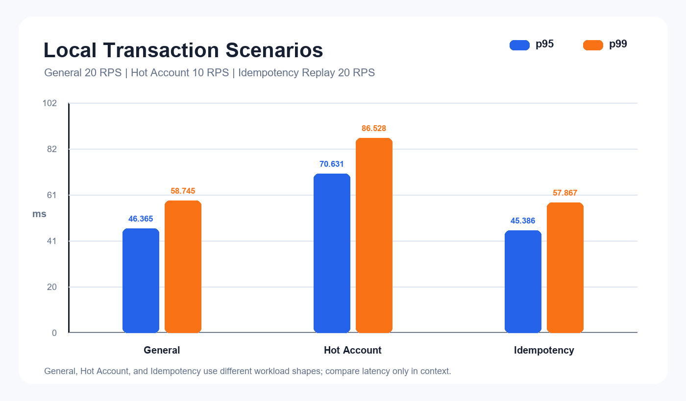
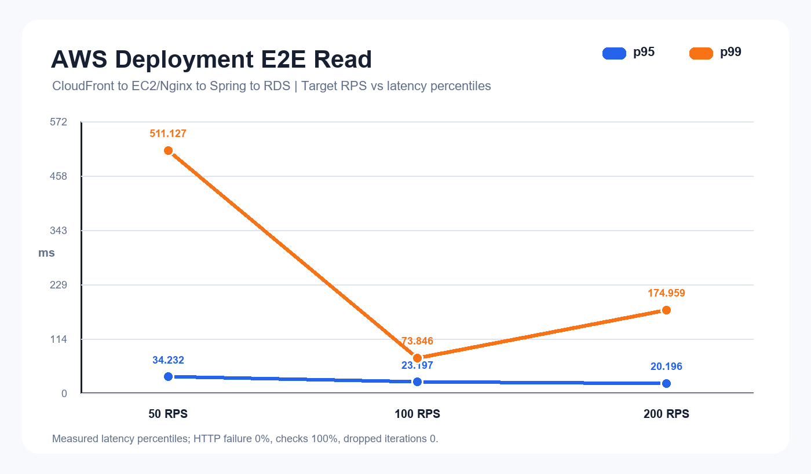
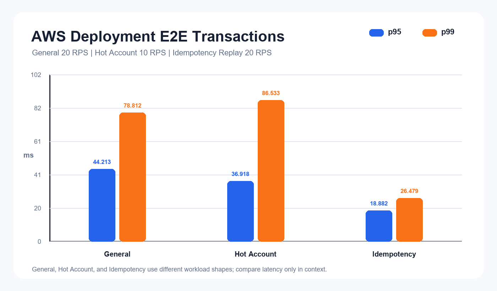

# BankingPJ

금융 거래의 **정합성, 동시성, 중복 처리 방지**를 중심으로 구현한 인터넷뱅킹 Full Stack 포트폴리오 프로젝트입니다.

단순한 계좌 CRUD에 그치지 않고 이체 과정의 원자성, 동일 계좌에 대한 동시 요청, 네트워크 재시도로 발생하는 중복 이체, 대량 거래내역 조회 성능을 코드와 통합 테스트, k6 실측으로 검증했습니다.

## 핵심 기술

| 영역 | 기술 | 적용 목적 |
|---|---|---|
| Frontend | React 19, TypeScript, Vite | 타입 기반 SPA와 빠른 개발 환경 |
| 상태·입력 | TanStack Query, React Hook Form, Zod | 서버 상태 동기화와 입력 검증 |
| Backend | Java 21, Spring Boot 4.1.1, Spring MVC | REST API와 금융 업무 처리 |
| 인증 | Spring Security, JWT | Access Token 인증과 Refresh Token 재발급 |
| 데이터 | JPA/Hibernate, MySQL 8, Flyway | 영속성 관리와 재현 가능한 스키마 변경 |
| 검증 | JUnit, Testcontainers, Vitest, React Testing Library | 실제 MySQL 통합 테스트와 UI 흐름 검증 |
| 성능 | JDBC Batch Seeder, k6, EXPLAIN ANALYZE | 대량 데이터 생성과 병목 측정 |
| 배포 | Docker, Nginx, AWS EC2/RDS/S3/CloudFront | 정적 Frontend와 API를 하나의 HTTPS 진입점으로 제공 |

## 핵심 기능

- 회원가입, 로그인, Access/Refresh Token 재발급, 로그아웃
- 계좌 생성, 목록·상세 조회와 소유권 검증(IDOR 방어)
- 입금, 출금, 잔액 부족 검증과 Ledger 기록
- 계좌 간 이체와 Transfer/Ledger 동시 기록
- UUID 기반 `Idempotency-Key`를 사용한 중복 이체 방지
- 계좌별 거래내역 Pagination
- 계좌 `ACTIVE`, `SUSPENDED`, `CLOSED` 상태 관리
- 사용자·계좌 상태 요약과 Quick Action을 제공하는 Dashboard
- 공통 Validation, ErrorCode, ApiResponse와 `X-Request-ID` 추적

금액은 Backend에서 `BigDecimal`, MySQL에서 `DECIMAL(19,4)`로 처리합니다. Frontend는 금융 합계를 JavaScript 부동소수점으로 계산하지 않으며, 서비스의 원 단위 금액을 `123,456원`처럼 천 단위 구분기호와 함께 표시합니다.

## 전체 아키텍처

### Local 개발



### AWS 배포



AWS에서는 CloudFront가 Private S3의 Frontend와 EC2의 API를 경로에 따라 연결했습니다. 사용자 지정 도메인 없이 CloudFront 기본 HTTPS 도메인을 사용했으며, 테스트 완료 후 비용 방지를 위해 AWS 리소스는 삭제했습니다.

## 금융 정합성 설계

### Transaction과 Rollback

이체는 출금 계좌 검증과 잔액 차감, 수취 계좌 잔액 증가, `Transfer` 생성, 양쪽 `LedgerEntry` 저장을 하나의 `@Transactional` 범위에서 처리합니다. 어느 단계에서든 예외가 발생하면 전체 작업이 rollback되어 일부 잔액이나 원장만 저장되는 상태를 막습니다.



### Pessimistic Lock

입금·출금·상태 변경과 이체 대상 계좌를 `PESSIMISTIC_WRITE`로 조회해 최신 잔액을 기준으로 변경합니다. 이체에서는 두 계좌를 항상 **account ID 오름차순**으로 잠급니다. 반대 방향 이체도 같은 순서를 사용하므로 교차 잠금에 따른 deadlock 가능성을 줄입니다.

### Idempotency

Frontend는 이체마다 UUID 기반 `Idempotency-Key`를 전송합니다. Backend는 다음 두 장치를 함께 사용합니다.

1. `(user_id, idempotency_key)` DB UNIQUE 제약으로 동시 중복 요청을 선점합니다.
2. 사용자, 출금 계좌, 수취 계좌, 정규화 금액으로 SHA-256 request fingerprint를 생성합니다.

동일 key와 동일 body가 재전송되면 기존 `Transfer`와 DEBIT Ledger를 이용해 원래 결과를 반환합니다. 같은 key에 다른 body가 들어오면 충돌 오류로 처리합니다. k6 replay 테스트에서 동일 transferId와 추가 Ledger 미생성을 확인했습니다.

### Ledger

잔액만 변경하지 않고 모든 입출금과 이체를 원장에 남깁니다. 이체 1건에는 출금 계좌의 음수 `DEBIT`과 수취 계좌의 양수 `CREDIT` 두 건이 같은 transferId로 연결되며, 각 원장에는 처리 후 잔액 `balance_after`가 기록됩니다.

### Authorization과 IDOR 방어

계좌 ID를 받는 API는 JWT의 사용자 ID와 계좌 소유자를 함께 조회합니다. 다른 사용자의 계좌는 존재 여부를 드러내지 않는 공통 계좌 미존재 오류로 처리해 URL의 accountId 변경만으로 타인 데이터에 접근할 수 없도록 했습니다.

## DB와 조회 성능

성능 테스트 전용 JDBC Batch Seeder는 일반 애플리케이션 실행과 분리된 Gradle task로만 동작합니다. 생성 시각을 1년 범위에 분산하고 chunk 단위로 commit하여 수백만 건을 하나의 거대한 transaction으로 처리하지 않습니다.

| Scale | Users | Accounts | Transfers | Ledger entries |
|---|---:|---:|---:|---:|
| LARGE | 100,000 | 200,000 | 1,000,000 | 2,000,000 |

거래내역은 다음 복합 인덱스로 계좌별 최신 원장을 조회합니다.

```sql
CREATE INDEX idx_ledger_account_history
    ON ledger_entries (account_id, created_at DESC, ledger_entry_id DESC);
```

LARGE 데이터셋의 `ledger_entries` 2,000,000건에서 직접 실행한 `EXPLAIN ANALYZE` 결과입니다.

| 조건 | 실행 시간 |
|---|---:|
| 복합 인덱스 사용 | 약 1.85ms |
| `IGNORE INDEX` | 약 687ms |
| 차이 | 약 371배 |

이 수치는 DB에서 SQL을 직접 측정한 실행 계획 결과입니다. 네트워크와 애플리케이션 처리가 포함된 아래 k6 HTTP latency와 같은 지표로 비교하지 않았습니다.

## Local k6 성능 테스트

LARGE 데이터셋을 사용한 로컬 API 측정입니다. 모든 시나리오에서 HTTP failure는 0%, checks는 100%, dropped iterations는 0건이었습니다.

| Scenario | Target | Actual RPS | p95 | p99 | Failure | Dropped |
|---|---:|---:|---:|---:|---:|---:|
| Read throughput | 50 RPS | 49.815 | 15.634ms | 21.538ms | 0% | 0 |
| Read throughput | 100 RPS | 99.682 | 13.108ms | 16.883ms | 0% | 0 |
| Read throughput | 200 RPS | 199.271 | 12.916ms | 15.549ms | 0% | 0 |
| General Transfer | 20 RPS | 19.253 | 46.365ms | 58.745ms | 0% | 0 |
| Hot Account | 10 RPS | 9.983 | 70.631ms | 86.528ms | 0% | 0 |
| Idempotency Replay | 20 RPS | 19.637 | 45.386ms | 57.867ms | 0% | 0 |





200 RPS는 시스템의 최대 처리량을 뜻하지 않습니다. **현재 측정한 200 RPS 범위까지 목표 부하를 유지했다**는 의미입니다.

General Transfer는 여러 source 계좌에 분산했고, Hot Account는 같은 source 계좌에 요청을 집중했습니다. Hot Account의 p95/p99 증가는 동일 행의 lock contention이 지연에 미친 영향을 보여줍니다. General 목표는 20 RPS, Hot 목표는 10 RPS이므로 RPS 차이 자체를 잠금으로 인한 처리량 감소로 해석하지 않았습니다.

Idempotency Replay는 성공률 100%였고, 모든 replay에서 기존 transferId가 반환되며 추가 Ledger가 생성되지 않는 것을 검증했습니다.

## AWS 배포와 E2E 성능 테스트

실제 배포에서는 다음 네트워크 경계를 적용했습니다.

- RDS Public Access 비활성화
- RDS 3306은 EC2 Security Group에서만 허용
- Spring Boot 8080은 외부에 공개하지 않고 Nginx만 접근
- EC2 HTTP 80은 CloudFront origin-facing prefix list로 제한
- SSH는 배포 당시 관리자의 My IP만 허용
- CloudFront `/api/*` behavior는 API 응답을 캐시하지 않도록 `CachingDisabled` 적용
- SPA 새로고침은 CloudFront 403/404를 `/index.html`로 연결

AWS 측정은 `k6 → CloudFront HTTPS → EC2/Nginx → Spring Boot Docker → RDS MySQL` 전체 경로의 E2E 결과입니다.

| Scenario | Target | Actual RPS | p95 | p99 | Failure | Dropped |
|---|---:|---:|---:|---:|---:|---:|
| Read throughput | 50 RPS | 49.797 | 34.232ms | 511.127ms | 0% | 0 |
| Read throughput | 100 RPS | 99.566 | 23.197ms | 73.846ms | 0% | 0 |
| Read throughput | 200 RPS | 198.980 | 20.196ms | 174.959ms | 0% | 0 |
| General Transfer | 20 RPS | 19.762 | 44.213ms | 78.812ms | 0% | 0 |
| Hot Account | 10 RPS | 9.980 | 36.918ms | 86.533ms | 0% | 0 |
| Idempotency Replay | 20 RPS | 19.861 | 18.882ms | 26.479ms | 0% | 0 |





50/100/200 RPS 모두 현재 측정 범위의 목표 부하를 유지했습니다. 일부 구간에서 p99 tail latency spike가 관찰됐지만 모든 시나리오의 HTTP failure는 0%, checks는 100%, dropped iterations는 0건이었습니다. Idempotency Replay도 성공률 100%, 동일 transferId 반환, 중복 Ledger 방지를 확인했습니다.

Local은 LARGE 데이터셋에서 DB와 로컬 API 기준선을 측정했고, AWS는 실제 배포 네트워크 전체를 측정했습니다. 데이터셋과 실행 환경이 다르므로 두 결과를 직접적인 속도 우열로 비교하지 않습니다.

## 해결한 문제

| 문제 | 적용한 해결책 | 검증 |
|---|---|---|
| 이체 중 일부 처리만 반영될 위험 | 잔액 이동, Transfer, Ledger를 하나의 transaction으로 처리 | 중간 예외 전체 rollback 통합 테스트 |
| 동일 계좌 동시 출금의 Lost Update | `PESSIMISTIC_WRITE`로 최신 잔액 직렬화 | 실제 MySQL 동시성 테스트 |
| 양방향 이체의 교차 잠금 | account ID 기준 stable lock order | 이체 동시성/transaction 테스트 |
| 버튼 중복 클릭·네트워크 재시도 | Idempotency-Key, DB UNIQUE, request fingerprint | 동시 중복 및 k6 replay 검증 |
| 타인 계좌 ID 직접 접근 | JWT 사용자와 계좌 소유권을 함께 검증 | 계좌 상세·거래내역 통합 테스트 |
| 대량 거래내역 조회 | `(account_id, created_at DESC, ledger_entry_id DESC)` 인덱스 | EXPLAIN ANALYZE 전후 측정 |
| 동일 계좌 집중 부하 | General/Hot Account 시나리오 분리 | p95/p99 lock contention 관찰 |
| 환경별 접속 정보와 secret | 환경변수와 Git 제외 env 파일로 분리 | Docker 및 AWS 실행 확인 |
| 외부에 노출된 DB·애플리케이션 포트 | Private RDS와 Security Group 연결 제한 | AWS E2E 배포 검증 |
| Frontend와 API의 HTTPS 경로 분리 | CloudFront 단일 진입점과 `/api/*` behavior | 실제 AWS E2E k6 테스트 |

## 테스트 전략

- **MVC slice test**: Validation, 공통 ApiResponse, BusinessException, 예상하지 못한 예외의 정보 비노출
- **Security test**: JWT 인증/인가, 공개 API와 보호 API 구분
- **Integration test**: 회원가입·로그인·Refresh, 계좌 소유권, 입출금, 상태 변경, 거래내역
- **Transaction test**: 입출금과 이체 중간 실패 시 잔액·Transfer·Ledger rollback
- **Concurrency test**: 동일 계좌에 대한 동시 요청의 성공/실패 수, 최종 잔액, Ledger 수 검증
- **Idempotency test**: 같은 key/body replay와 같은 key/다른 body 충돌, 동시 중복 요청 검증
- **Frontend test**: 인증, Dashboard, 계좌, 입출금·이체, 거래내역, Loading/Error/Empty 흐름
- **Performance test**: 대량 Seeder, DB 실행 계획, Local/AWS k6 시나리오

## 프로젝트 구조

```text
BankingPJ/
├─ 01.frontend/          # React + TypeScript SPA
├─ 02.backend/           # Spring Boot API, Flyway, tests
├─ 03.infra/
│  ├─ aws/               # AWS 배포 절차 문서
│  └─ k6/                # Local/AWS 성능 테스트 스크립트
├─ docs/
│  ├─ assets/            # README 성능 그래프
│  └─ generate-performance-charts.py
├─ compose.yaml          # Local MySQL/Redis
├─ run-backend.ps1       # 루트 .env를 읽는 Backend 실행 스크립트
├─ .env.example          # 비밀값 없는 설정 예시
└─ README.md
```

## 폴더별 문서

| 영역 | 문서 | 확인할 내용 |
|---|---|---|
| Frontend | [`01.frontend/README.md`](01.frontend/README.md) | Route → Page → API → Component 흐름, 인증과 Query cache |
| Backend | [`02.backend/README.md`](02.backend/README.md) | Controller → Service → Repository, Lock·Transaction·Idempotency |
| Infra | [`03.infra/README.md`](03.infra/README.md) | Local/AWS 구조, Docker·Nginx·k6 연결 |

## 로컬 실행

### 1. 환경설정

Java 21, Node.js, Docker Desktop이 필요합니다. 루트 예시 파일을 복사한 뒤 placeholder를 로컬 값으로 바꿉니다. 실제 secret은 Git에 추가하지 않습니다.

```powershell
cd C:\BankingPJ
Copy-Item .env.example .env
```

주요 환경변수는 다음과 같습니다.

```text
MYSQL_DATABASE=<로컬 DB 이름>
MYSQL_USER=<로컬 DB 사용자>
MYSQL_PASSWORD=<로컬 DB 비밀번호>
MYSQL_ROOT_PASSWORD=<로컬 root 비밀번호>
JWT_ACCESS_SECRET=<32바이트 이상 키의 Base64 값>
JWT_ACCESS_TTL_SECONDS=<초>
JWT_REFRESH_TTL_SECONDS=<초>
AUTH_COOKIE_SECURE=false
CORS_ALLOWED_ORIGINS=http://localhost:5173
```

### 2. MySQL과 Redis

```powershell
docker compose up -d
```

### 3. Backend

루트 실행 스크립트가 `.env`의 Docker 변수명을 Spring 환경변수로 매핑합니다.

```powershell
.\run-backend.ps1
```

직접 실행하려면 `DB_HOST`, `DB_NAME`, `DB_USERNAME`, `DB_PASSWORD`, `JWT_ACCESS_SECRET` 등을 현재 PowerShell 프로세스에 설정한 뒤 실행합니다.

```powershell
cd .\02.backend
.\gradlew.bat bootRun
```

### 4. Frontend

```powershell
cd C:\BankingPJ\01.frontend
Copy-Item .env.example .env.local
npm ci
npm run dev
```

production build에서는 `VITE_API_BASE_URL`을 실제 API origin으로 설정해야 합니다. 이 값은 브라우저에 포함되므로 secret을 넣지 않습니다.

### 5. 검증 명령

```powershell
cd C:\BankingPJ\02.backend
.\gradlew.bat test

cd C:\BankingPJ\01.frontend
npm test
npm run build
```

## 성능 데이터와 k6 실행

Seeder는 일반 실행에서 자동 동작하지 않으며, 운영 DB에 사용하지 않습니다. 반드시 별도의 `bankingpj_perf` DB와 로컬 테스트 계정으로 명시적으로 실행합니다.

```powershell
cd C:\BankingPJ\02.backend
$env:DB_NAME='bankingpj_perf'
$env:DB_USERNAME='<성능 DB 사용자>'
$env:DB_PASSWORD='<성능 DB 비밀번호>'
$env:SEEDER_TEST_PASSWORD='<로컬 테스트 비밀번호>'
.\gradlew.bat seedData -PseedScale=LARGE
```

Local k6 전체 실행 방법과 결과 파일 구조는 [`03.infra/k6/README.md`](03.infra/k6/README.md)를 참고합니다. AWS 배포 절차는 [`03.infra/aws/README.md`](03.infra/aws/README.md)에 정리되어 있습니다.

## Secret과 Git 관리

- `.env`, `.env.*`, raw k6 결과, build output, 로그는 Git에서 제외합니다.
- `.env.example`, 소스, 테스트, Flyway migration, Dockerfile과 README는 버전 관리합니다.
- 비밀번호, JWT, Access/Refresh Token, RDS endpoint, IP, AWS 계정정보를 문서나 로그에 기록하지 않습니다.
